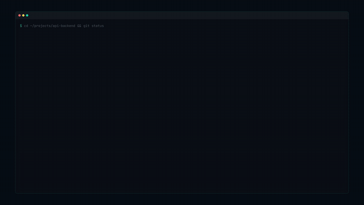

# cdp

<div align="center">

<picture>
  <source media="(prefers-color-scheme: dark)" srcset="./docs/assets/cdp-logo-dark-transparent.png">
  
</picture>

**[English](./README.md)** | **简体中文**

**[🌐 访问 cdp 官方网站](https://goldenzqqq.github.io/cdp/)**

在 Vibe Coding 时代，为 Claude Code、Codex、Gemini CLI、Cursor、VS Code 用户准备的**终端项目工作台**。

`cdp` 不只是项目切换器——它知道你的每个仓库是否干净、有没有未推送的提交，还能一键切换并启动 AI CLI。

[](./LICENSE)
[](https://github.com/GoldenZqqq/cdp)
[](https://www.powershellgallery.com/packages/cdp)
[](https://www.powershellgallery.com/packages/cdp)

</div>

---

## 演示视频

[](https://goldenzqqq.github.io/cdp/#proof)

[在官网观看高清演示](https://goldenzqqq.github.io/cdp/#proof) · [直接打开 v2.0 MP4](https://goldenzqqq.github.io/cdp/assets/cdp-v2-promo.mp4)

这支 v2.0 演示展示了 cdp 的核心功能：`cdp status` 多项目 Git 仪表盘、`cdp api -Open codex` 一步切换并启动 AI CLI、`cdp workspace` 多项目工作区、onEnter 环境自动激活、智能 Tab 补全，以及 Windows / macOS / Linux 全平台支持。

---

## 为什么需要 cdp

AI CLI 工具把开发者重新带回终端，但多项目切换仍然很笨重：

```powershell
PS C:\> cd E:\Work\Client Projects\VeryLongName\backend
PS E:\Work\Client Projects\VeryLongName\backend> cd ..\..\..\SideProjects\tooling
PS E:\SideProjects\tooling> cd C:\Learn\another-project
```

`cdp` 把这件事缩短成：

```powershell
PS C:\> cdp
# 输入 api / blog / cdp 等关键词
# 回车后直接进入项目根目录
```

更让人头疼的是——你根本不知道哪个仓库还有未提交的代码：

```bash
# 50 个仓库，哪些有未提交的改动？哪些忘了 push？
cd project1 && git status && cd ../project2 && git status && ...
```

`cdp status` 一条命令搞定：

```text
$ cdp status
  #  Project       Branch   Status        Sync   Last Commit
  01 my-api        main     x 3 dirty     ^1     2 hours ago
  02 blog          main     + clean              5 days ago
  03 admin-panel   dev      ! 2 untracked        1 hour ago

3 repos need attention
```

它特别适合：

- 同时维护很多项目的开发者
- 使用 Claude Code、Codex、Gemini CLI 等终端 AI 工具的人
- 依赖 VS Code/Cursor Project Manager 管理项目的人
- 需要在 Windows PowerShell 和 WSL/Linux 之间共享项目列表的人
- macOS / Linux 原生开发者（bash/zsh 全兼容）

---

## 快速开始

### Windows PowerShell

如果已经习惯 PowerShell Gallery，可以直接安装模块并安装 `fzf`：

```powershell
# 1. 安装 cdp
Install-Module -Name cdp -Scope CurrentUser

# 2. 安装 fzf 依赖
winget install fzf

# 3. 导入并验证
Import-Module cdp
cdp doctor

# 4. 开始切换项目
cdp
```

第一次使用、希望脚本自动处理 `fzf` 和 profile 配置时，推荐从源码安装：

```powershell
git clone https://github.com/GoldenZqqq/cdp.git
cd cdp
.\Install.ps1 -AddToProfile
```

`Install.ps1` 会依次尝试 `winget`、`scoop`、`chocolatey` 安装 `fzf`；如果安装后当前终端还找不到 `fzf`，重启 PowerShell 后运行 `cdp doctor`。

### WSL / Linux / macOS

```bash
# macOS 用户先安装依赖
brew install fzf jq

# 一键安装（WSL/Linux/macOS 通用）
bash <(curl -fsSL https://raw.githubusercontent.com/GoldenZqqq/cdp/main/install-wsl.sh) --auto

source ~/.bashrc  # zsh 用户改为 source ~/.zshrc
cdp doctor
cdp
```

`--auto` 会自动安装 `fzf` 和 `jq`；不加 `--auto` 时会逐项询问。

---

## 30 秒使用示例

```powershell
# 添加当前目录为项目
cd E:\Projects\my-api
cdp-add

# 首次使用：创建配置并可扫描 Git 仓库
cdp init E:\Projects

# 从任意位置打开项目选择器
cdp

# 只有一个匹配时直接进入项目；多个匹配时再打开 fzf
cdp api

# 进入项目并启动 AI CLI 或编辑器
cdp api -Open codex
cdp api -Open code

# 批量导入某个目录下的 Git 仓库
cdp-scan E:\Projects

# 查看当前配置健康状态
cdp doctor

# 安全修复失效路径、重复项目和缺失字段
cdp clean
cdp doctor --fix

# 查看当前版本、配置和升级命令
cdp version

# 查看最近访问过的项目
cdp recent

# 一条命令查看所有仓库的 Git 状态
cdp status

# 只看需要关注的仓库（dirty / untracked / behind）
cdp status --dirty

# Tab 补全：输入 cdp 后按 Tab 自动补全子命令和项目名
cdp s<TAB>  # → status, scan, ...

# 将常用项目固定在列表顶部
cdp pin api
cdp unpin api

# 添加短别名和标签；PowerShell 查询标签时需要引号
cdp alias api backend
cdp tag api work
cdp backend
cdp '@work'

# 从 PowerShell 直接启动 WSL 并进入项目
cdp -WSL
```

fzf 菜单里输入几个字母即可模糊匹配：

```text
cdp v2.0.3 | 56 projects | enter to warp | C:\Users\you\.cdp\projects.json
cdp > api

  01  my-api          C:\Work\my-api
> 02  company-admin   C:\Work\company-admin
  03  personal-blog   C:\Work\personal-blog

Preview
-------
name   company-admin
state  path exists
git    git repo detected
```

选择后：

- 当前 shell 进入项目根目录
- Windows Terminal / 常见终端标签标题更新为项目名
- WSL 模式会自动把 `C:\path` 转为 `/mnt/c/path`
- 使用 `-Open` 时，会在项目根目录继续启动 Codex、Claude、Gemini、VS Code、Cursor 或其他 PATH 命令

---

## 真实使用场景

### 多仓库日常开发

同时维护公司后台、前端应用、脚本工具和个人项目时，可以先用 `cdp-scan E:\Projects` 批量导入 Git 仓库。之后从任意终端运行 `cdp api`、`cdp admin` 或 `cdp blog`，唯一匹配时直接进入项目，多匹配时再用 `fzf` 选择。

### AI CLI 工作流

使用 Claude Code、Codex、Gemini CLI 等工具时，终端通常是主工作台。`cdp` 会把项目根目录切换、终端标签标题和项目列表放在一起，减少在多个 AI 会话、多个仓库之间反复复制长路径的时间。

需要直接启动 AI CLI 时，可以用 `cdp api -Open codex`、`cdp web -Open claude` 或 `cdp tool -Open gemini`。如果想打开编辑器，可以用 `cdp api -Open code` 或 `cdp api -Open cursor`。

### Windows + WSL 混合环境

Windows PowerShell 可以读取 Cursor / VS Code Project Manager 配置；WSL/Linux 版也能使用同类 JSON 项目列表。需要从 PowerShell 进入 WSL 项目时，用 `cdp -WSL` 选择项目，Windows 路径会自动转换为 `/mnt/c/...`。

---

## 核心特性

- **多项目 Git 状态仪表盘**：`cdp status` 一条命令查看所有仓库的分支、dirty/untracked 状态、ahead/behind 同步和最近提交时间
- **全平台支持**：Windows PowerShell 5.1/7.x + macOS (zsh/bash) + Linux + WSL，CI 覆盖全部
- **智能 Tab 补全**：输入 `cdp` 按 Tab 自动补全子命令和项目名，PowerShell + bash + zsh 全支持
- **模糊搜索切换项目**：由 `fzf` 驱动，键盘优先，不需要记路径
- **Neon 风格 TUI**：彩色候选行、右侧项目预览、路径/Git 状态一眼可见
- **快速 query 跳转**：`cdp api` 唯一匹配时直接进入项目，多匹配时只在候选中选择
- **AI CLI 工作区启动**：`cdp api -Open codex` 先进入项目根目录，再启动 Codex、Claude、Gemini、VS Code 或 Cursor
- **兼容 Project Manager**：自动读取 VS Code/Cursor Project Manager 配置
- **自带项目管理命令**：`cdp-add`、`cdp-rm`、`cdp-ls`、`cdp-config`
- **批量 Git 扫描**：`cdp-scan` 可把目录下的 Git 仓库批量导入配置
- **最近访问项目**：`cdp recent` / `cdp-recent` 按最后访问时间列出最近切换过的项目
- **项目置顶 / 收藏**：`cdp pin api` 把常用项目固定在选择器和列表顶部
- **标签与短别名**：`cdp alias api backend` 添加短别名；`cdp tag api work` 后可用 `cdp '@work'` 过滤项目
- **配置健康检查与修复**：`cdp doctor` 检查依赖、JSON、重复项目名、失效路径；`cdp clean` 安全修复项目配置
- **Windows + WSL/Linux**：PowerShell 和 bash/zsh 版本共享同一类配置
- **终端标签同步**：切换后自动把 tab title 改为项目名

---

## 命令列表

### PowerShell

| 命令 | 别名 | 说明 |
| --- | --- | --- |
| `Invoke-Cdp` | `cdp` | 短命令入口，默认打开项目选择器 |
| `Show-CdpProjectStatus` | `cdp status`, `cdp-status` | 查看所有项目的 Git 状态仪表盘，支持 `--dirty` 和 `@tag` 过滤 |
| `Invoke-Cdp -Query api` | `cdp api` | 按名称或路径快速匹配项目，唯一匹配时直接切换 |
| `Invoke-Cdp -Query api -Open codex` | `cdp api -Open codex` | 切换到项目并启动 Codex、Claude、Gemini、VS Code、Cursor 或其他 PATH 命令 |
| `Switch-Project` | - | 打开 fzf 菜单并切换项目 |
| `Switch-Project -Query api` | - | 只在匹配 `api` 的项目中切换 |
| `Switch-Project -Query api -Open code` | - | 切换到项目并打开 VS Code |
| `Switch-Project -WSL` | `cdp -WSL` | 选择项目并启动 WSL 进入目录 |
| `Test-ProjectHealth` | `cdp doctor`, `cdp-doctor` | 诊断 cdp 环境和配置 |
| `Repair-ProjectConfig` | `cdp clean`, `cdp-clean` | 安全修复配置：禁用失效路径、去重、补齐 `pinned` 字段 |
| `Initialize-Cdp` | `cdp init`, `cdp-init` | 首次使用初始化：创建配置、保存选择、可扫描 Git 仓库 |
| `Add-ProjectAlias` | `cdp alias`, `cdp-alias` | 给项目添加短别名，之后可直接用别名匹配 |
| `Remove-ProjectAlias` | `cdp unalias`, `cdp-unalias` | 移除项目短别名 |
| `Add-ProjectTag` | `cdp tag`, `cdp-tag` | 给项目添加标签，PowerShell 中用 `cdp '@work'` 查询 |
| `Remove-ProjectTag` | `cdp untag`, `cdp-untag` | 移除项目标签 |
| `Show-CdpAbout` | `cdp about`, `cdp version` | 显示 cdp Logo、版本、配置路径、项目数量和升级命令 |
| `Get-CdpRecentProjects` | `cdp recent`, `cdp-recent` | 列出最近访问过的项目 |
| `Set-ProjectPin` | `cdp pin`, `cdp-pin` | 将项目固定在选择器和列表顶部 |
| `Clear-ProjectPin` | `cdp unpin`, `cdp-unpin` | 取消项目置顶 |
| `Add-Project` | `cdp-add` | 添加当前目录或指定路径 |
| `Import-GitProjects -RootPath E:\Projects` | `cdp-scan`, `cdp scan` | 扫描 Git 仓库并批量导入配置 |
| `Remove-Project` | `cdp-rm` | 删除项目，支持交互选择 |
| `Get-ProjectList` | `cdp-ls` | 列出已启用项目 |
| `Edit-ProjectConfig` | `cdp-edit` | 打开配置文件 |
| `Set-ProjectConfig` | `cdp-config` | 切换当前使用的配置文件 |

### WSL / Linux

| 命令 | 说明 |
| --- | --- |
| `cdp` | 打开 fzf 菜单并切换项目 |
| `cdp status` / `cdp-status` | 查看所有项目的 Git 状态仪表盘，支持 `--dirty` 和 `@tag` 过滤 |
| `cdp api` | 按名称或路径快速匹配项目，唯一匹配时直接切换 |
| `cdp api --open codex` | 切换到项目并启动 Codex、Claude、Gemini、VS Code、Cursor 或其他 PATH 命令 |
| `cdp doctor` / `cdp-doctor` | 诊断依赖、配置和项目路径 |
| `cdp clean` / `cdp-clean` | 安全修复配置：禁用失效路径、去重、补齐 `pinned` 字段 |
| `cdp init ~/code` / `cdp-init ~/code` | 首次使用初始化：创建配置、保存选择、可扫描 Git 仓库 |
| `cdp alias api backend` / `cdp-alias api backend` | 给项目添加短别名 |
| `cdp tag api work` / `cdp-tag api work` | 给项目添加标签，bash/zsh 中可用 `cdp @work` 查询 |
| `cdp about` / `cdp version` | 显示版本、配置路径、项目数量和升级命令 |
| `cdp recent` / `cdp-recent` | 列出最近访问过的项目 |
| `cdp pin api` / `cdp-pin api` | 将项目固定在选择器和列表顶部 |
| `cdp unpin api` / `cdp-unpin api` | 取消项目置顶 |
| `cdp-add` | 添加当前目录或指定路径 |
| `cdp-scan ~/code` / `cdp scan ~/code` | 扫描 Git 仓库并批量导入配置 |
| `cdp-ls` | 列出已启用项目 |
| `cdp-config` | 切换当前使用的配置文件 |

---

## 配置来源

cdp 会按以下规则寻找项目配置：

1. `CDP_CONFIG` 环境变量
2. 已保存的 `cdp-config` 选择
3. Cursor Project Manager 配置
4. VS Code Project Manager 配置
5. 自定义配置 `~/.cdp/projects.json`

如果你已经使用 [Project Manager](https://marketplace.visualstudio.com/items?itemName=alefragnani.project-manager)，通常无需额外配置。否则可以直接用：

```powershell
cd E:\Projects\my-api
cdp-add

# 或者一次性扫描某个目录下的 Git 仓库
cdp-scan E:\Projects
```

自定义配置文件格式：

```json
[
  {
    "name": "my-api",
    "rootPath": "E:/Projects/my-api",
    "enabled": true,
    "pinned": false,
    "aliases": ["backend"],
    "tags": ["work", "api"]
  },
  {
    "name": "personal-blog",
    "rootPath": "D:/Code/blog",
    "enabled": true,
    "pinned": true,
    "aliases": [],
    "tags": ["writing"]
  }
]
```

`pinned`、`aliases`、`tags` 都是可选字段；旧配置没有这些字段时会按未置顶、无别名、无标签处理。建议在 JSON 中使用 `/`，避免 Windows 反斜杠转义。

最近访问记录保存在独立状态文件 `~/.cdp/state.json`，不会写回 `projects.json`。自动化或测试场景可以用 `CDP_STATE_PATH` 指向临时状态文件。

---

## 性能建议

如果第一次打开 Windows Terminal 后运行 `cdp` 需要等待几秒，通常不是项目数量本身造成的。PowerShell 首次自动加载模块、PATH 中查找 `fzf`，以及 Windows 对 `fzf.exe` 的冷启动检查都可能带来额外延迟。

可以在 PowerShell profile 里固定常用配置和 `fzf` 路径，减少首次交互前的探测：

```powershell
$env:CDP_CONFIG = "$HOME\.cdp\projects.json"
$env:CDP_FZF_PATH = "C:\Users\you\AppData\Local\Microsoft\WinGet\Links\fzf.exe"
```

`CDP_FZF_PATH` 应填写 `(Get-Command fzf).Path` 返回的实际路径。`cdp` 也会在同一个 PowerShell 会话中缓存已解析的项目配置，配置文件被 `cdp-add`、`cdp-scan`、`cdp-rm` 修改后会自动失效并重新读取。

---

## 诊断与排错

先运行：

```powershell
cdp doctor
```

它会检查：

- `fzf` 是否在 `PATH` 中
- PowerShell Gallery 是否有新的 `cdp` 版本
- bash/zsh 版是否安装 `jq`
- 当前使用哪个配置文件
- JSON 是否能解析
- 项目字段是否完整
- 是否有重复项目名
- 启用项目的路径是否存在

常见问题：

```powershell
# fzf 未安装
winget install fzf

# winget 不可用时
scoop install fzf
choco install fzf -y

# 重新导入模块
Import-Module cdp -Force

# 升级 cdp（PowerShell Gallery 安装）
Update-Module -Name cdp -Scope CurrentUser -Force

# 如果不是通过 Install-Module 安装，或 Update-Module 找不到旧安装记录
Install-Module -Name cdp -Scope CurrentUser -Force -AllowClobber

# 查看当前项目列表
cdp-ls

# 安全修复配置
cdp clean
cdp doctor --fix

# 切换配置文件
cdp-config
```

---

## 和其他工具的区别

| 工具 | 项目切换 | 项目状态总览 | AI CLI 集成 | 说明 |
| --- | --- | --- | --- | --- |
| `cd` / Tab 补全 | 手动输入路径 | 无 | 无 | 路径深、项目多时成本高 |
| `zoxide` / `autojump` | 按频率跳转 | 无 | 无 | 只知道路径，不知道”项目” |
| 纯 `fzf cd` 脚本 | 扫描目录选择 | 无 | 无 | 一次性列表，无统一配置 |
| VS Code Project Manager | 编辑器内切换 | 无 | 无 | 仅限编辑器内使用 |
| **cdp** | **模糊搜索 + query 直达** | **`cdp status` 全仓库仪表盘** | **`-Open codex/claude/gemini`** | 终端里的项目工作台 |

cdp 的重点不是替代所有跳转工具，而是把”项目根目录切换”和”项目状态总览”合在一起。zoxide 擅长跳到去过的任意目录；cdp 知道你的项目列表、每个仓库的 Git 状态，还能一键启动 AI CLI。

---

## 开发

### 官网预览与发布

官网是 `docs/` 下的纯静态 GitHub Pages 站点，无需安装前端依赖：

```powershell
python -m http.server 4173 --directory docs
```

然后访问 `http://localhost:4173`。首次发布时，在 GitHub 仓库 **Settings → Pages** 中选择 **Deploy from a branch**，分支设为 `main`，目录设为 `/docs`；后续推送到 `main` 会自动更新官网。

```powershell
# 导入本地模块
Import-Module ./cdp.psd1 -Force

# 运行诊断
cdp doctor .\examples\projects.json

# 运行测试
Import-Module Pester -MinimumVersion 5.5.0 -Force
Invoke-Pester -Path ./tests -CI
```

CI 覆盖：

- Windows PowerShell 5.1
- PowerShell 7.x
- Ubuntu bash smoke test
- macOS zsh smoke test

---

## 路线图

- [x] fzf 项目切换
- [x] VS Code/Cursor Project Manager 配置读取
- [x] 自定义配置文件
- [x] 项目添加、删除、列出、配置切换
- [x] PowerShell + WSL/Linux 支持
- [x] `cdp doctor` 诊断命令
- [x] GitHub Actions 基础 CI
- [x] 最近访问项目
- [x] 项目置顶 / 收藏
- [x] `cdp <query>` 非交互快速匹配
- [x] 批量扫描 Git 仓库生成配置
- [x] 切换项目后启动 AI CLI / 编辑器
- [x] `cdp doctor --fix` / `cdp clean` 自动修复失效路径和重复项
- [x] `cdp init` 首次使用向导
- [x] 项目标签 / 别名
- [x] `cdp status` 多项目 Git 状态仪表盘
- [x] macOS 原生支持（zsh + bash）
- [x] 智能 Tab 补全（PowerShell + bash + zsh）

---

## 贡献

欢迎提交 issue 和 PR。开始前请阅读 [CONTRIBUTING.md](./CONTRIBUTING.md)。

```powershell
git clone https://github.com/GoldenZqqq/cdp.git
cd cdp
git checkout -b feature/your-feature

Import-Module ./cdp.psd1 -Force
Invoke-Pester -Path ./tests -CI
```

提交信息建议：

```text
Add: 添加项目健康检查命令
Fix: 修复 WSL 路径转换
Docs: 重写快速开始说明
```

---

## 致谢

- [fzf](https://github.com/junegunn/fzf)
- [Project Manager](https://marketplace.visualstudio.com/items?itemName=alefragnani.project-manager)

## License

[MIT](./LICENSE)
